# Terraform Basics - Lab 1

## Mission Objective

* Creating simple resources from scratch

## Checkpoints

* Create files in terraform with examples.
* ensure the files successfully applies in terraform.
* Verifty all aspects in the AWS account.
* Deliverables - collect screenshots for review.

## Prerequisites

* AWS account
* Visual Studio Code
* Terraform directory
* Patience & lots of coffee

## Step - 1 (File creation)

* Create new folder
* Open the folder in VS code
* Open New Termainal - 3 Dots next to Run Tab
* Create 2 new tf files in your folder (example - touch main.tf/provider.tf)
* Go to terraform registry, navigate to documentation sections and search for aws provider to find code.
* Copy the code from terraform registry and paste it in your .tf files.
* Use the closet aws region to you
* Ensure that you are using the access key and secret key for your IAM account.

See screenshots below

Main
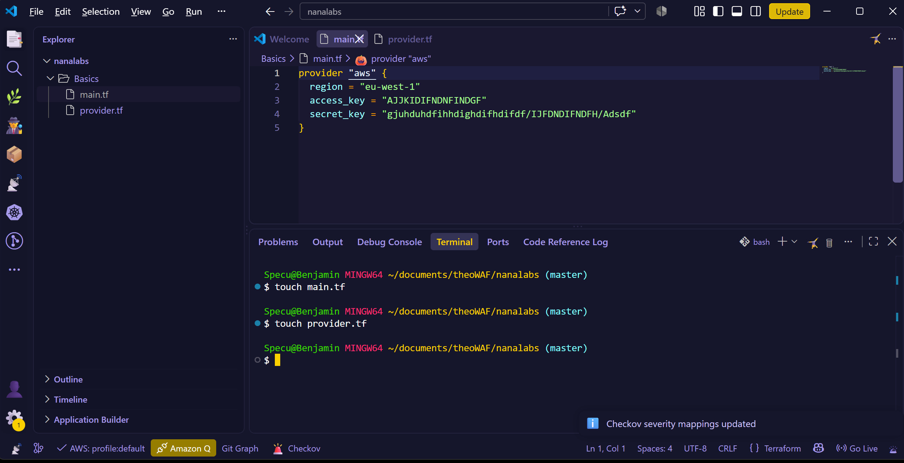
Provider
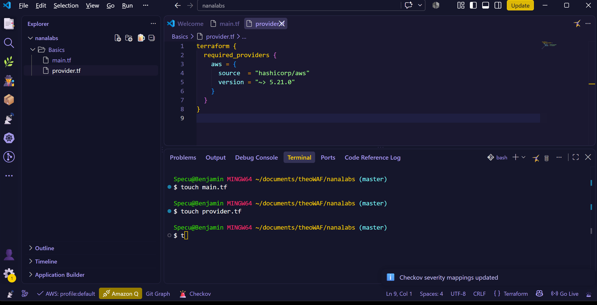

## Step - 2 (Resources creation)

* Go to terraform registry, navigate to documentation sections and search for resources to find code.
* Copy the code from terraform registry and paste it in your .tf files.
* Create resource for vpc
* Create a second resource for subnet in an availability zone.

See screenshots below

Resources for VPC & Subnet 
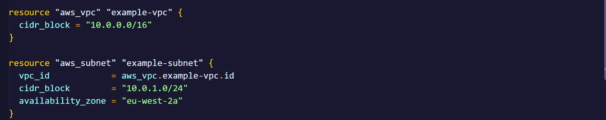

## Step - 3 (Terraform)

Input the following command in the terminal panel (Bash).

* Terraform init
* Terraform validate
* Terraform plan
* Terraform apply

See screenshots below

Terraform init & Validate
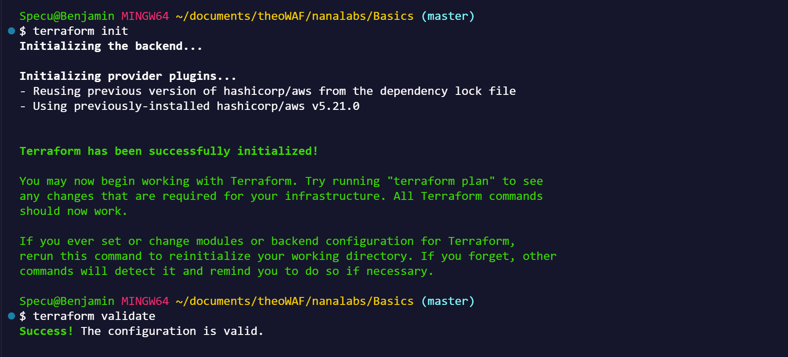
Terraform plan - Part 1 
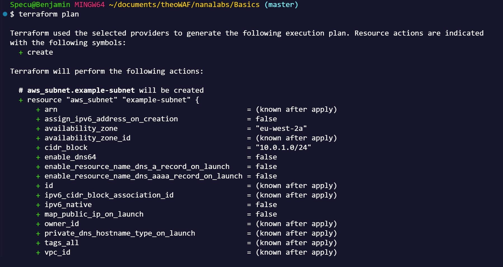
Terraform plan - Part 2
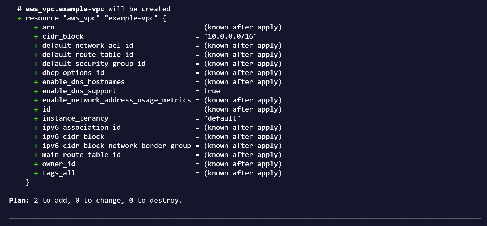

Terraform apply
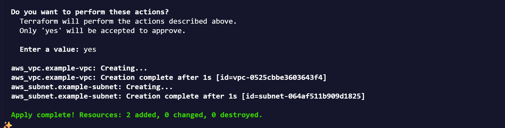

## Step - 4 (Data & Subnet creation)

* Go to terraform registry, navigate to documentation sections and search for data sources to find code.
* Locate data script for aws-vpc.
* Copy the code from terraform registry and paste it in your main.tf file.
* set your default to true
* Go to terraform registry, navigate to documentation sections and search for resources to find subnet code.
* Copy the code from terraform registry and paste it in your main.tf file.
* In the second subnet resources body:
    * reference the data script with full name and Id at the end.
    * Use an existing cidr block (e.g default cidr block)
    * Use the same AZ as the first subnet

## Step - 5 (Terraform - Part 2)

Input the following command in the terminal panel (Bash).

* Terraform apply -auto-approve

See screenshots below

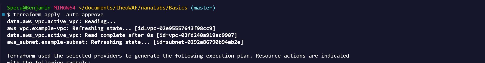

## Errors

* You may run into errors, if you dont configure the subnets properly.
* Adjust cidr ranges in your configuration. 

See screenshots below

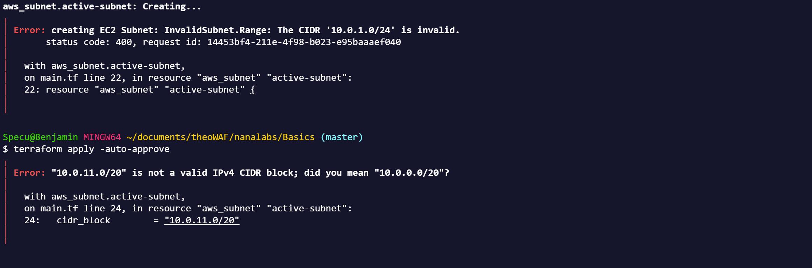

## Deliverables

* Congrats you have successfully completed your mission and you are now ready for more pain.
Collect screenshots for your records.

Example-vpc
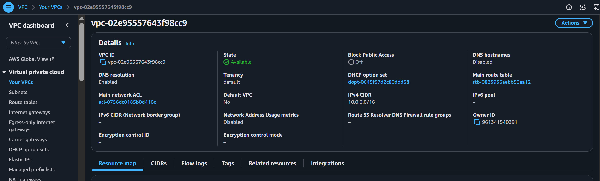

Second Subnet
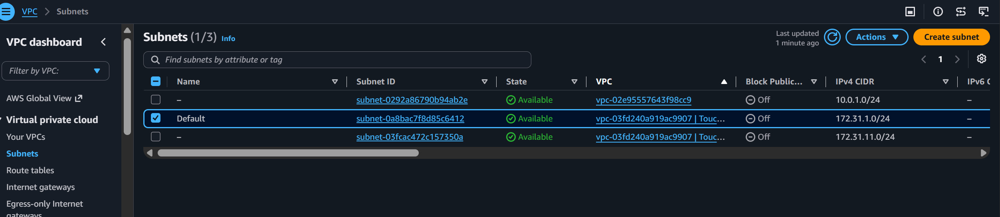

## ** Final Step - Teardown **

Unless you can print your own money, you will need to tear down your deployment.

* Input "Terraform Destroy" in your VS code.
* You will be asked to confirm deletion - say yes.
* Double check your aws console that deployments are terminated.
* Triple check everything - Jeff Bezos has enough money, don't give him more.

## Author

Executive producer: Newest-It-Bro

